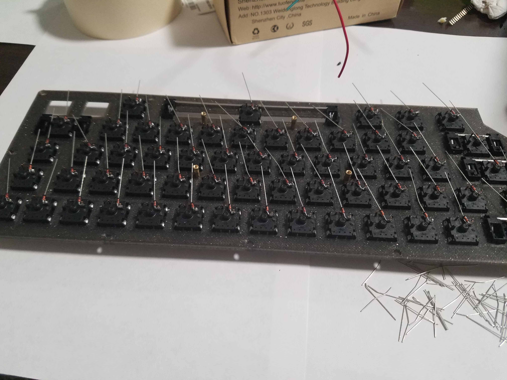
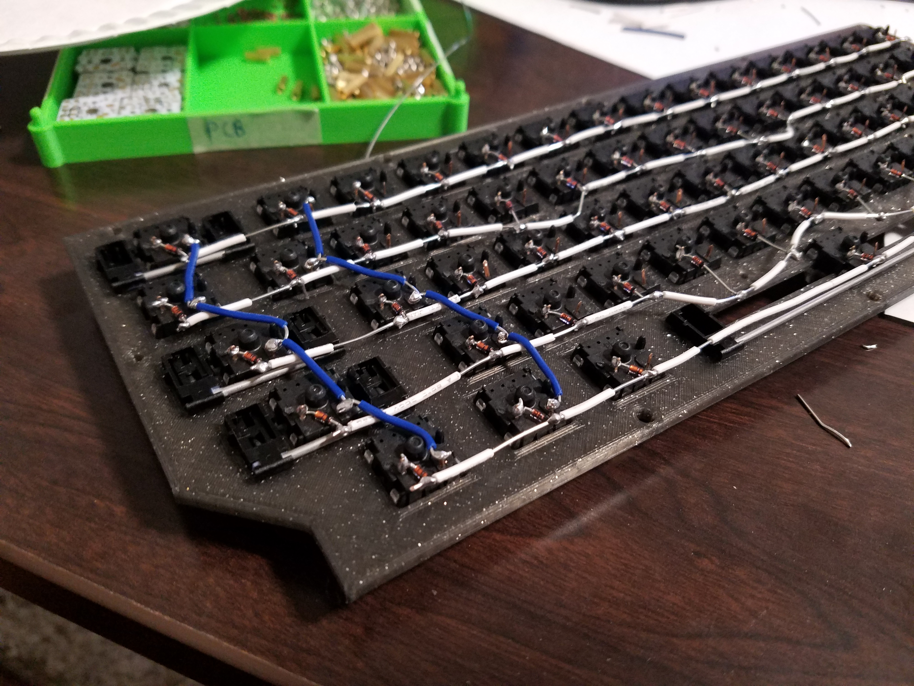
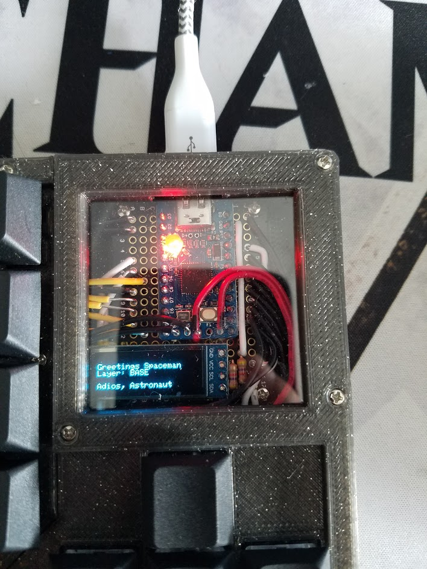

3dPrinto is the name affectionately given to my totally 3d printed keyboard project. I'm not so sure I really like the name, but I ended up calling my 3d printer "Printy" after waffling on what to call it for a while, so Printo seemed like the natural progression...

## Impetus and General Concept
This keyboard came about because a friend approached me and said he wanted a keyboard with short travel distance, heavy-ish linear switches, and also it had to cost under $100. Clocking in at $85-$90 all said and done, and with an OLED screen on a hand-wired board. I think I'm going to call it a win. So without further ado, here's a pic of the completed board. In a minute, I'll move on to why I think it's totally awesome and worth it to design and build a keyboard yourself.
![finished1][finished1]

![finished2][finished2]

## The Design Process
I started out by designing the layout on [Keyboard Layout Editor][kle]. I started with a pretty basic 60% layout. Initially, I wanted to do a 65% or similar, but it was requested that the board have arrow keys, and along with 0.1% of the rest of the population of the world, my friend also uses right shift and didn't want a smaller right shift. That meant no arrow keys embedded into the right side of the board, at least not in any sort of standard way. For a while, I looked to the Anne Pro 2 for inspiration. On that board, the alt/fn/control/etc. keys in the bottom right are their default functions when held, but act as arrow keys when tapped. Unfortunately, that doesn't work too well for games or other pgorams that use the arrow keys for anything besides short burts of moving around text.

Eventually, I reasoned that since I was hand-wiring the board, I'd need somewhere to put the micro-controller anyway, so why not go with a TenKey-Less (TKL) layout, sans those extra keys that  nobody uses anyway. In the extra blank space, I'd have plenty of space for the controller without adding any thickness to the board, and as a bonus, I could put a sick window in the case.

I've been very into building PCs for basically as long as I can remember, so a window to see your components just made sense. The main problem I identified was that, other than a pro-micro, a keyboard really doesn't have much in the way of components. I looked into hand-soldering the micro-controller and all the other doo-dads, similar to the [Keyhive Lattice][khl], and a variety of other boards, but that was difficult to do without a "real" pcb, thanks to the varying requirements for part orientation. A bespoke PCB would certainly be outside of the $100 price range, so in the interest of adding more components, I settled on an OLED screen, which I was able to grab for $4. More on that later.  
Back to "real" design. I used [SwillKB][skb] to transform my layout from [Keyboard Layout Editor][kle] into a series of svg drawing, each representing a layer of the case. 

## 3d modelling and printing
Initially, I went about modelling and printing the case in what I now think was a very foolish way. [SwillKB][skb] produces cases in the "sandwich" style, and produces 2d drawings of each layer in the sandwich. This is awesome if your goal is to send those files off to a laser cutting service, since they can only cut shapes into flat materials. However, you have some benefits and drawbacks with 3d-printing. The primary benefit is that your parts don't have to be flat with uniform thickness. The drawback is they're made of relatively flimsy plastic, where-as laser cut parts can be made with all manner of things, from thick acrylics to steel.

Anyway, in my first few attempts, I basically used my 3d printer to mimic a laser cutter. I turned the 2d drawings into uniform thickness, flat pieces, and printed them one by one. Here's a picture of just the bottom of the case (below the plate) as a result of that process:
![bottom layers][bunchalayers]

You can see the bottom layer, with all the stand-offs screwed in, and then two other layers (split into two pieces each thanks to 3d printing size limits) just above it. This was difficult to assemble, had a lot of potential errors, since any mistake in tolerance was multiplied by the number of parts, and didn't look great, and wasn't super stable. Unfortunately, I was stuck on the whole sandwich case thinking until nearly the end of the project.

Initially, most of my design changes focused on getting the window in just the right place, lining up all the stand-off holes, making sure the switches fit properly into the plate, making sure the USB port was in the right place, making sure there were clearances for wiring and such where there needed to be, and other such "small" chores. 

The next big design hurdle was deciding how to have a removable cord. At first, I was going to simply let the cord permanently sit in the case, plugged in forever, with a "free-floating" micro-controller, as is the case with a lot of janky hand-wired builds. But, eventually I realized you can buy little breadboard PCBs on Amazon for roughly $1 each, and so that became my strategy. This also meant I could mount my OLED screen directly to the bread-board, and wouldn't need to model a custom stand/holder for it. I tested out several iterations of how everything would fit, moving stand-offs around to accomodate the screen...
![test fit 1][test1]

I ended up going with having the screen in the bottom left corner. It required some stand-off modification, which wasn't ideal, but it looked nice, and it allowed the resistors to be visible instead of hidden underneat the PCB, and visibility of components was a goal of the build. At this point, I had done some very rough test fits, but I still wasn't sure (at all) that everything worked. I wired up the OLED wrongly, and set about trying to debug it in software for hours. Those of you who have memorized the pinout for the elite C will notice that pin B1 is neither SCL nor SDA. Those honors belong to pins D0 and D1, both on the left side of the board...
![wrong pins][pins]

After an irritating amount of struggling with the software (despite having it correct on attempt #1), I realized my wiring mistake, and was able to correct it!
![Hello World][hw]

With a probably working case (I still hadn't at this point test fit the entire thing), and a definitely working OLED screen, I set out to start wiring the keyboard.

## Modding the swithces

Unfortunately, I don't have a ton (any really) pictures of this part of the process. The long and short of it is that I bought some 1mm ball bearings on Amazon, dropped 2 of them into each stem (Gateron Black switches were used), with some Trybosis3204 lubricant. I also lubed the little stabilizer bits on the left and right side of the switch, and I did not lube the spring, because I didn't think I had enough lube. I also put trybosis 3204 all over the stabilizers. I wasn't sure about clipping, and since there was no PCB anyway, I just didn't clip them. 

I'm 99% sure I don't like these switches (at least with the mods), as I've typed this whole article up to this point with them, and the short travel distance is making my fingers hurt. However, my friend (who the board is for) actually wanted 2mm travel. I convinced him 3mm was a fine medium, and I'll update this article with his review. I do think that the ball bearing modded gateron blacks produce a [very nice typing sound][yt_sound].

## Wiring the switches

I inserted all of the switches into the plate, and got to wiring. I very loosely followed [this guide][hwg]. I wrapped the diodes around each switch, and crimped them with a pair of needlenose pliers:

Next, I wired up the rows, wrapping the diode legs around each row-wire. I intentionally cut the insulation short, so that it wouldn't cover all of the bare wire on the rows between the switches. This meant that I would have room to solder. After soldering, I pushed the insulation all the way to the left. Since the pins for the columns were to the right (as pictured below) this meant that even if the column wires were bare, I wouldn't have to worry about shorts.

If I had the chance to re-do, I would read [the guide][hwg] more closely, and I think I would have ended up with a much neater result. Sadly, I seem to have lost the pictures I took of the board after finishing wiring up the micro-controller, and the board is currently in the mail, so don't hold your breath. It was fairly simple, I pre-cut several wires to length, put them in a couple bundles with electrical tape, and ran those bundles between the switches (under the row and column wiring). Wherever they needed to connect, I woul pull a wire out of the bundle, cut it to length, strip the end, and connect it to the row or column. 

A useful thing to remember when hand-wiring is that it doesn't matter where on the row or column you wire to, which gives you a lot of freedom in routing your wires/bundles.

Because of print size limiations, the portion of the board that held the controller and arrow keys was separate from the that held the remainder of the keys. To that end, I separately wired the arrow keys into some of the extra pins provided by the elite-c. I socketed the elite-c, so that I could remove and replace it easily, which allowed me much easier access to those extra pins along the bottom edge. The red and black wires visible below go to the arrow keys. 

Overall, I'm pretty happy with how the component view turned out, with my major regret being the inconsistent wire insulation lengths on the yellow wires on the left. The light on the elite-C is wired to VCC, and can't be turned off, so I 3d printed a small cap then hot glued it over the LED, to dull it significantly. 

## Final modifications and assembly.

After finishing wiring up the plate, I finally got smart and decided to merge the 3 bottom layers into one 3d printed file. I decided to keep the top "lip" as a separate file, so that the window could be easily removed and the pro micro reset manually if necessary. The keyboard is now made of 6 distinct pieces. The bottom of the case has a left and right half, the plate is divided into the 60% portion, and the arrow keys + window portion, and the small lip around the edge of the keyboard is divided the same way. The plate, and by extension top lip are held up by stand-offs, while the bottom layer is connected by a set of dowels that go between the two halves. In addition, I used a glue gun to melt the plastic together on the bottom, so I doubt it's going anywhere. 

The keycaps were $25 on Amazon, and chosen to go with the black aesthetic. The filament used, both for proto-typing and final assembly was a marble black filament that I found on Amazon for around $25. If you're interested, I'll try and include a rough parts and cost breakdown below. Here's a short video of the OLED in action. I haven't programmed much functionality into it as of yet, but I expect the board's new owner will modify it in some clever way.

<video width="100%" controls>
  <source src="20200305_203632.mp4" type="video/mp4">
</video>

Overall, I'm really happy with how the board as a whole turned out. If you watch the [sound test][yt_sound], you'll see that the spacebar is a little scratchy. This is mostly due to the cheap keycaps coming with a bent spacebar. Other than that, the only other major problem the board has is that because the 3d printer can't print a perfectly sharp edge (round nozzle), the switches aren't held in place super firmly. They'll never come out during normal use, but if you're pulling caps, it's definitely a concern. Since the board is hand-wired, repairs in that situation would be annoyingly difficult. Other than that, the board is way sturdier than I ever thought it could be. With the 4 stand-offs under the main key section, there is basically no flex. I'd compare it to an aluminum plate in terms of lack of flex, though not at all in terms of sound profile. Without the standoffs, I think the spacebar would flex fairly dramatically, as it has a large hole to make room for the stabilizers.

The OLED screen might be a bit too far in the corner, it's a bit difficult to see the bottom row of text if your keyboard is forward on your desk. If I was going to do it again, I think I'd try to figure out a way to put the screen in the upper left corner. If you have any questions, feel free to hit me up on reddit, under the username purxiz, or on github, under the same. Thanks for reading! 

## Rough Parts and Cost Breakdown

* 80 Gateron Black Switches, $20 at [SwitchTop][st]
* 1 Elite-C Microcontroller, $17 at [Keeb.io][keeb]
* 1 breadboard PCB, $1 on Amazon (bought in a 6 pack for $6)
* 1 128x32 OLED Screen, $4 on Amazon (bought in a 3 pack for $12)
* ~150 1mm ball bearings, $5 on Amazon (bought in a 1000 pack for $5)
* 1 vial Trybosis3204 Lube, $5 at [SwitchTop][st]
* 4 2u Cherry Plate mount Stabilizers, and one 6.25U stabilizer, $9.25 at [SwitchTop][st]
* ~80 diodes, basically free at anywhere that sells keyboard or electronics stuff
* a couple resistors for the OLED screen, same as above
* Wire and Solder, same as above
* Generic black PBT Keycaps, $25 on Amazon
* 3d printed case, priceless (roughly $5 in Filament).

With a couple bucks allocated for the solder and wires, that brings the total cost to $96.25, just under the target price point.

## Tools and Software I used
* needlenose pliers
* flush trimmers
* Artillery Sidewinder X1 3d printer
* Fusion 360
* Hakko Fx-888D soldering station

[st]: http://switchtop.com
[keeb]: http://keeb.io
[hw]: helloworld.jpg
[pins]: 20200303_202257.jpg
[finished1]: 20200312_112504.jpg
[finished2]: 20200312_112508.jpg
[bunchalayers]: bunchalayers.jpg
[test1]: 20200229_172745.jpg
[kle]: http://keyboard-layout-editor.com
[khl]: https://keyhive.xyz/shop/lattice
[skb]: http://builder.swillkb.com
[yt_sound]: https://youtu.be/K-E8iRcjEGY
[hwg]: https://geekhack.org/index.php?topic=87689.0
